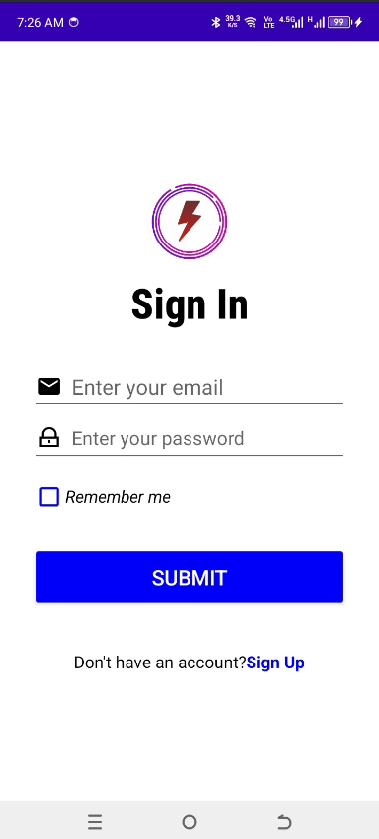

# Mobile Programming Android App



## Overview

This repository contains an educational Android application project named **mobile_programming**. It is structured to help students and educators learn Android development through practical examples, labs, and unit-wise exercises. The project covers a wide range of Android concepts, including UI layouts, user authentication, data storage, networking, and Google Maps integration.

## Features
- Multiple activities and fragments demonstrating core Android concepts
- Organized by units, practicals, and labs for structured learning
- User authentication (Login/SignUp)
- Profile management
- List, Grid, and RecyclerView implementations
- Google Maps integration (location features)
- Network requests using Volley
- Modular code for easy navigation and understanding

## Project Structure
```
mobile_programming/
├── app/
│   ├── src/
│   │   └── main/
│   │       ├── java/com/bca/mobile_programming/
│   │       │   ├── unit_1/ ... unit_7/
│   │       │   ├── lab/
│   │       │   └── practical/
│   │       ├── res/
│   │       │   ├── layout/
│   │       │   ├── drawable/
│   │       │   ├── values/
│   │       │   └── ...
│   │       └── AndroidManifest.xml
│   ├── build.gradle.kts
│   └── ...
├── build.gradle.kts
├── settings.gradle.kts
├── gradle/
├── gradlew, gradlew.bat
└── README.md
```

## Getting Started

### Prerequisites
- [Android Studio](https://developer.android.com/studio)
- Android SDK 26 or higher
- Java 11

### Setup Instructions
1. **Clone the repository:**
   ```bash
   git clone https://github.com/yourusername/mobile_programming.git
   ```
2. **Open in Android Studio:**
   - Select `Open an existing project` and choose the cloned folder.
3. **Sync Gradle:**
   - Let Android Studio download dependencies and sync the project.
4. **Run the App:**
   - Use an emulator or a physical device to build and run the app.

### Google Maps API Key
If you want to use the map features, replace the API key in `app/src/main/AndroidManifest.xml`:
```xml
<meta-data
    android:name="com.google.android.geo.API_KEY"
    android:value="YOUR_API_KEY_HERE" />
```

## Permissions
The app requests the following permissions:
- Internet access
- Network state
- Fine and coarse location (for map features)

## Contributing
Contributions are welcome! Please open issues or submit pull requests for improvements or bug fixes.

## License
(Add your license here)

---

**Happy Learning Android!**